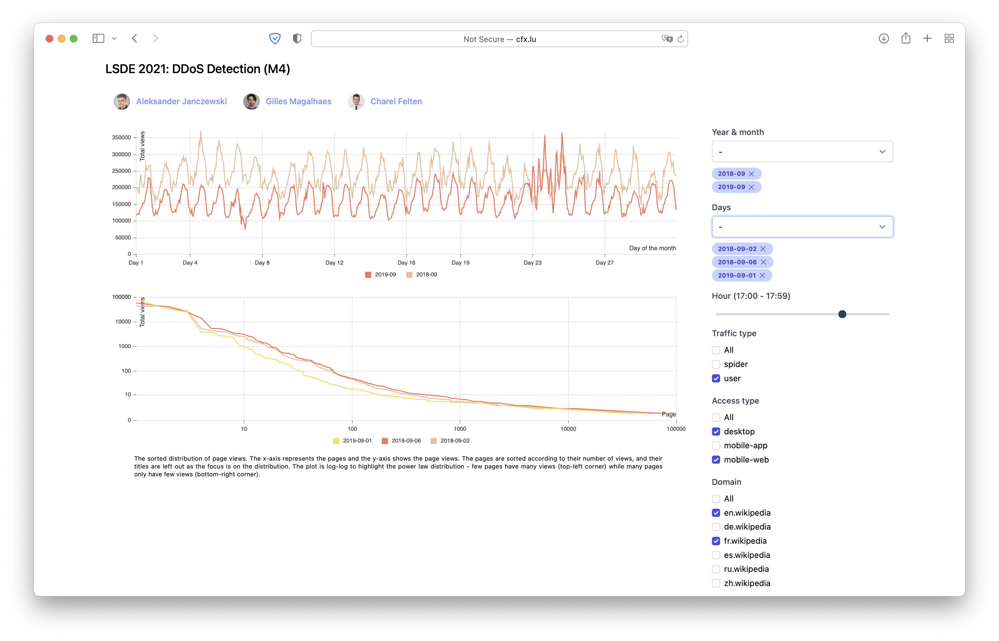

# Wikimedia DDoS detection with pageviews data

## Initial Task

From the [LSDE Course Page](https://event.cwi.nl/lsde/2021/practical2_projects.shtml#M4):

> Wikipedia publishes [hourly page view statistics](https://dumps.wikimedia.org/other/pageview_complete/readme.html) for their projects. This data is available in this shape from 2015 onwards. The popularity of topics in Wikipedia can give an indication of the interest of people over time and space (the latter, specifically in non-english language domains).

> **W4: DDOS Detection.** Find Distributed Denial Of Service (DDOS) attacks to Wikipedia. This should include devising criteria to distinguish DDOS attacks from trending topics. Summarize these attacks over time and cluster them by theme

## Our work

We investigated various sources of pageviews data. We then downloaded it to our AWS S3 cluster and ran queries on it using a Spark with Databricks running on an EC2 instance. We ran queries and aggregated results, then downloaded them locally to further investigate with Numpy and Pandas and visualise with Matplotlib. We present our findings in the final report and on the visualisation website

## Visualisation

We made a website for the visualisation, which can be found at [cfx.lu/lsde](https://cfx.lu/lsde).

## Repository structure

| Directory          | Description                                                                                      |
| ------------------ | ------------------------------------------------------------------------------------------------ |
| report.pdf         | Report related to this project                                                                   |
| data               | Generated datasets used for analysis and website                                                 |
| exploration        | Development scripts grouped by team member                                                       |
| img                | Generated images for the report                                                                  |
| notes              | Notes about the investigated datasets                                                            |
| pipeline           | Data pipeline source code used for collection, preparation (cleaning), analysis and data product |
| website            | Source code for website                                                                          |
